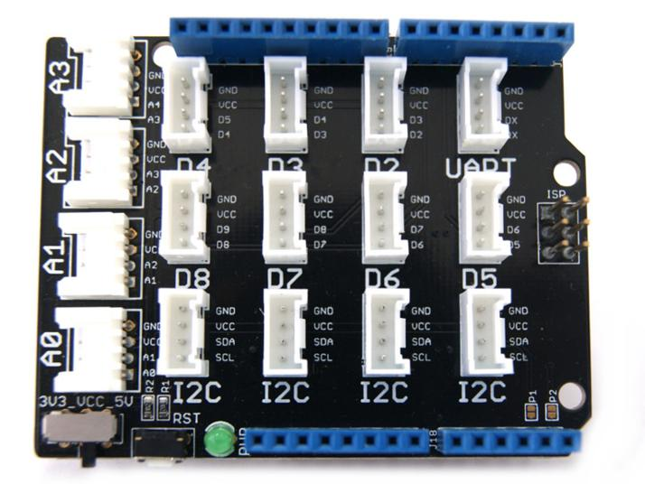
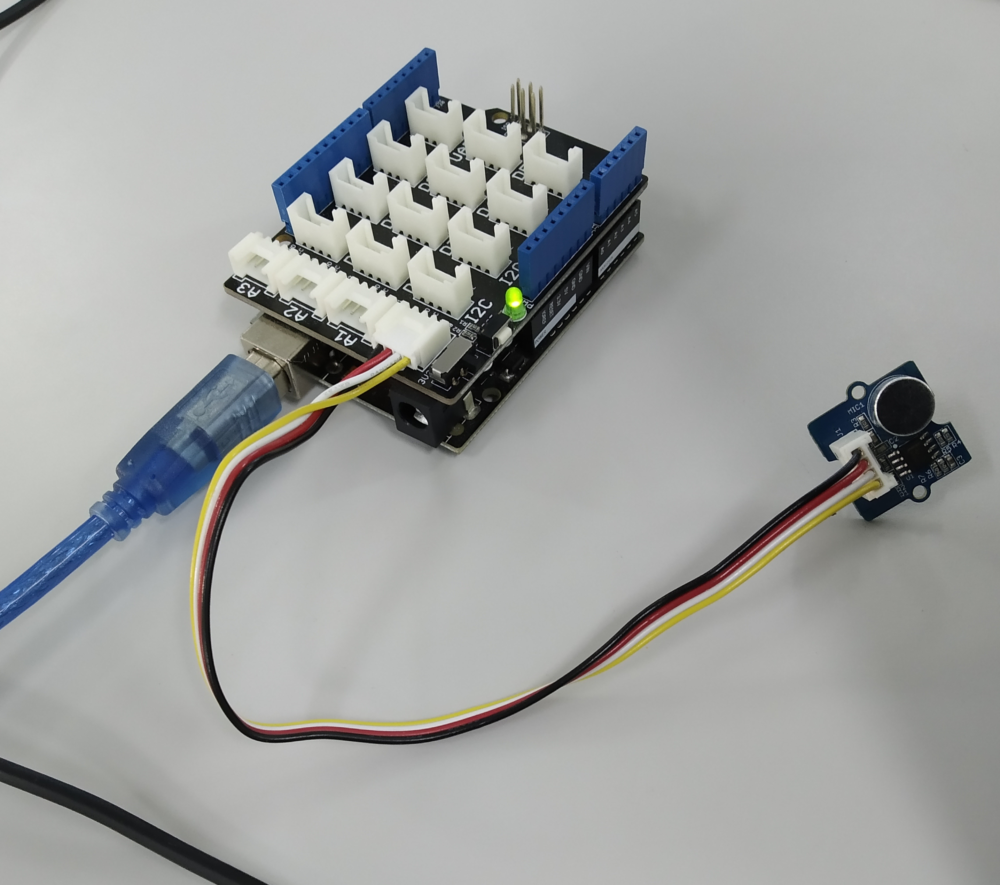

# Semaforo de ruido en el aula monitorizado por imágenes

Esta práctica consiste en registrar el nivel de ruido de un aula con un micrófono y mostrar una imagen en función de nivel detectado.
El micrófono se conecta a Arduino UNO a través de un Shield. 
Las imágenes que se mostrarán son:
- Nivel bajo

- Nivel medio

- Nivel alto

## Materiales

- Arduino UNO

- Base Shield Arduino SEEED Grove V2

- Sensor de sonido Grove

| Especificaciones              |       |
| -------------------------------- | ------ |
|  Operating Voltage Range                      | 3.⅗ V     |
| Operating Current(Vcc=5V)          | 4~5 mA   |
| Voltage Gain(V=6V, f=1kHz) | 26 dB   |
| Microphone sensitivity(1kHz)              | 52-48 dB   |
| Microphone Impedance             | 2.2k Ohm   |
| Microphone Frequency              | 16-20 kHz   |
| Microphone S/N Radio             | 54 dB   |

## Montaje

## Programación en Arduino

## Programación en Processing

## Enlaces de interés

- 

-

